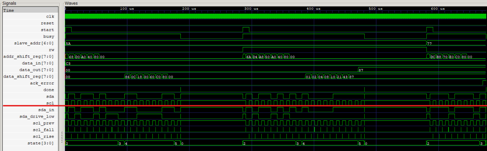

# I2C Master Controller
This repository contains a robust, synthesizable I2C Master module written in SystemVerilog. The module serves as a communication bridge between a host system (such as an FPGA or microcontroller) and external I2C peripherals (slaves).

The architecture utilizes a continuous SCL generator. Internally using synchronous edge-detectors (`scl_fall` and `scl_rise`). This allows the state machine to predictably shift and sample data in exact alignment with the physical I2C clock edges.
> For more details and indepth knowledge about the I2C protocol, please refer to the official I2C specification: https://www.nxp.com/docs/en/user-guide/UM10204.pdf, also put in this repository as a pdf [NXP_I2C_Manual.pdf](docs/NXP_I2C_Manual.pdf)

## Features
* **Configurable Clock Rates:** The main system clock frequency and the target I2C bus frequency are fully parameterizable.
* **Protocol-Native Interface:** The module accepts standard I2C Read/Write bits directly (`0` for Write, `1` for Read), ensuring the host interface perfectly matches the physical protocol.
* **Error Handling:** Asserts an `ack_error` flag if a target peripheral fails to acknowledge an address or data byte.
* **Latency-Compensated State Machine:** Solves standard 1-clock-cycle synchronous latency by pre-loading ("priming") the SDA shift register immediately prior to data phases, ensuring zero bit-loss during Write operations.

---

## Pinout and Interface
### System Inputs
* `clk`: Main system clock (Default: 50 MHz).
* `reset`: Active-high synchronous reset.

### Control and Data Interface
* `start`: A single-cycle active-high pulse initiates an I2C transaction.
* `rw`: Determines the transaction type (`0` = Write, `1` = Read).
* `slave_addr` [6:0]: The 7-bit address of the target I2C peripheral.
* `data_in` [7:0]: The byte of data to be transmitted to the peripheral (ignored during Read operations).
* `data_out` [7:0]: The byte of data received from the peripheral (valid when `done` is asserted, garbage otherwise).

### Status Flags
* `busy`: Asserted (`1`) while a transaction is actively occurring on the bus.
* `done`: Pulses high (`1`) when a transaction successfully terminates.
* `ack_error`: Asserted (`1`) if a Not Acknowledge (NACK) is detected during any ACK phase.

### Physical I2C Bus
* `sda` (inout): Bidirectional serial data line.
* `scl` (output): Serial clock line generated by the master.

---

## Usage Examples

### Executing a Write Operation
To transmit the byte `0xC3` to a peripheral at address `0x5A`:
1. Assign `slave_addr = 7'h5A`.
2. Assign `data_in = 8'hC3`.
3. Assign `rw = 0` to indicate a Write operation.
4. Pulse the `start` signal high for one `clk` cycle.
5. Wait for the `done` signal to assert. If `ack_error` is `0`, the transmission was successful.

### Executing a Read Operation
To read one byte from a peripheral at address `0x5A`:
1. Assign `slave_addr = 7'h5A`.
2. Assign `rw = 1` to indicate a Read operation.
3. Pulse the `start` signal high for one `clk` cycle.
4. Wait for the `done` signal to assert.
5. If `ack_error` is `0`, the received data is available on the `data_out` bus.

---

## Architecture and State Machine

The module generates the `scl` clock by dividing the main `clk` and uses 1-cycle delayed signals (`scl_prev`) to create synchronous `scl_fall` and `scl_rise` trigger pulses. The state machine exclusively uses these triggers to ensure all SDA transitions happen strictly on the falling edge of SCL, and all sampling happens on the rising edge.

**State Progression:**
1. **IDLE:** Module is inactive, waiting for the `start` assertion.
2. **START:** Asserts the physical Start Condition (SDA transitions low while SCL is high).
3. **ADDRESS:** Shifts out the 7-bit `slave_addr` followed by the `rw` bit on consecutive `scl_fall` edges.
4. **ACK1:** Samples the peripheral's acknowledge bit on `scl_rise`. If executing a Write, this state pre-loads the first data bit onto SDA exactly on the exiting `scl_fall` to prevent 1-cycle latency collisions.
5. **DATA:** Sequentially transmits or receives 8 bits of data. Write operations shift on `scl_fall`; Read operations sample on `scl_rise`.
6. **ACK2:** Samples the peripheral's data ACK (Write) or drives the SDA line to generate a Master NACK (Read) to terminate the sequence.
7. **STOP_LOW / STOP_HIGH:** Stages the SDA line low, then releases it high while SCL is high to assert a clean, physical Stop Condition.
8. **DONE:** Asserts the `done` flag and prepares to return to `IDLE`.

# Steps to simulate and test the module:
1. Clone the repository and navigate to the project directory.
2. If you have Icarus Verilog and GTKWave installed, you can run the provided run.bat file.
3. The testbench will execute a series of Write and Read transactions, demonstrating the module's functionality and error handling capabilities.
4. GTKWave will open automatically to display the waveform of the simulation, allowing you to visually verify the timing and correctness of the I2C transactions.

# Output Waveform
